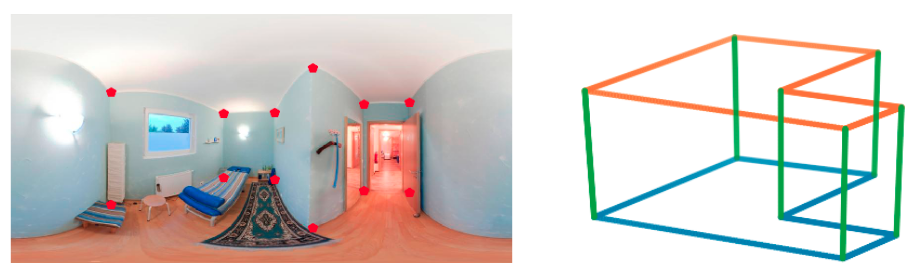

# 360 Scene Understanding
Some tools to work with 360 images!

## Lines and Vanishing Points directly on Panoramas
Panoramic images are special since straight lines in the world are projected as curved line segments in the image. Additionally, parallel lines in the world intersect in two antipodal vanishing points in panoramas whereas in conventional images they intersect in one single vp. Here we adopt the Manhattan World assumption whereby there exist three dominant orthogonal directions in the scene. 

<p align="center">

</p>

- To run the code:
```
main_linesVPs.m
```
Running time: ~ 3.8 seg/im with Matlab on Linux machine with an Intel Core 3.6 GHz (4 cores)

## EquiConvs
EquiConvs are special convolutions that adapt the kernel size and shape to the equirectangular distortions.
In the folder EquiConvs you can find a notebook showing how to compute and visualize the deformed kernel at different positions on the equirectangular image.

Check the [Project Page](https://github.com/cfernandezlab/CFL) for more details!

<p align="center">

</p>
  
## 3D Layout from 2D corners
In the folder 2Dto3D you will find a notebook with visualizations to go from 2D corners in the panoramic image to the 3D layout (up to a scale)

<p align="center">

</p>

You can find more details in Section III [supplementary material](https://cfernandezlab.github.io/docs/CFL_supp.pdf).

## Related Research
Please cite these papers in your publications if it helps your research. For lines and vanishing points, ``[Clara et al. 2018]``. For EquiConvs, ``[Clara et al. 2020]``. 3D Layout from 2D corners is used in both papers.

```bibtex
@article{fernandez2018layouts,
  title={Layouts from panoramic images with geometry and deep learning},
  author={Fernandez-Labrador, Clara and Perez-Yus, Alejandro and Lopez-Nicolas, Gonzalo and Guerrero, Jose J},
  journal={IEEE Robotics and Automation Letters},
  volume={3},
  number={4},
  pages={3153--3160},
  year={2018},
  publisher={IEEE}
}

@article{fernandez2020corners,
  title={Corners for layout: End-to-end layout recovery from 360 images},
  author={Fernandez-Labrador, Clara and Facil, Jose M and Perez-Yus, Alejandro and Demonceaux, C{\'e}dric and Civera, Javier and Guerrero, Jose J},
  journal={IEEE Robotics and Automation Letters},
  volume={5},
  number={2},
  pages={1255--1262},
  year={2020},
  publisher={IEEE}
}
```

## License 
This software is under GNU General Public License Version 3 (GPLv3), please see [GNU License](http://www.gnu.org/licenses/gpl.html)

For commercial purposes, please contact the authors.
